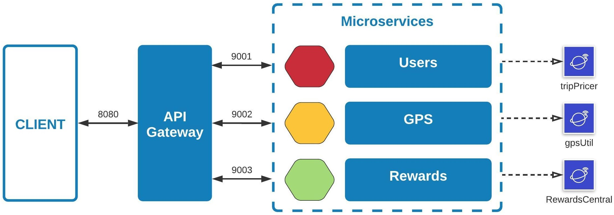

 * * *    * * *   * * * 

# TourGuide - Users

- OpenClassrooms - Project 8 / TourGuide App - Users microservice

- The application **'TourGuide'** is run with **Java 11**, **Gradle** and **Spring Boot v2.4.0** .

- This app can be used on mobile and pc, allows you to obtain information on tourist attractions, obtain rewards with personalized offers, and proposals for attractions based on geolocation.

---

---

## Technical

TourGuide is composed of 4 microservices:

1. **API Gateway**: https://github.com/ludovictuccio/TourGuide-Api_Gateway  
The API Gateway, used on port 8080.  
---

2. **Users**: https://github.com/ludovictuccio/TourGuide-Users  
The main application, that contains TripPricer.jar, used on port 9001.  
---

3. **GPS**: https://github.com/ludovictuccio/TourGuide-GPS  
The microservice used for the geolocation, that contains GpsUtil.jar, used on port 9002.  
---

4. **Rewards**: https://github.com/ludovictuccio/TourGuide-Rewards  
The microservice used for calculate the rewards, that contains RewardsCentral.jar, used on port 9003.  
---

**Feign** is used for the microservices relations.

---

## Installing

1. Install **Java**: https://www.oracle.com/java/technologies/javase-downloads.html  

2. Install **Gradle**: https://gradle.org/install/

In your IDE: 
- Eclipse: Install with Eclipse Marketplace: Gradle IDE Pack 3.8.x+1.0.x+2.2.x  
https://marketplace.eclipse.org/content/gradle-ide-pack
- project --> properties --> project natures --> add Java  

3. Install **Lombok** in your IDE before import project: https://www.baeldung.com/lombok-ide  
You must execute an external JAR.

## API documentation

- **Swagger 3:** http://localhost:9001/swagger-ui/index.html#/

## For Docker deploiement:

1. Install Docker Desktop:  
https://docs.docker.com/docker-for-windows/ or https://docs.docker.com/docker-for-mac/

2. To use the **Dockerfile**, you must run on the package root: 
- `docker build -t tourguide-users .`
- `docker run -d -p 9001:9001 tourguide-users`

3. (**Optional** - For a Docker-Compose deploiement)  
If you want to deploy all TourGuide microservices, use the **docker-compose.yml** on the package root, running:
- `docker-compose up -d`

## Endpoints

> **POST - Add new user**  
http://localhost:8080/user  
**Need body** with: userName, phoneNumber & emailAddress

> **PUT** - Update user preferences  
http://localhost:8080/user/updatePreferences  
**Need parameter**: userName  
**Need body** with: tripDuration, ticketQuantity, numberOfAdults & numberOfChildren

> **GET** - Get all user informations  
http://localhost:8080/user/getUser  
**Need parameter**: userName

> **GET** - Get user location (longitude/latitude)  
http://localhost:8080/user/getLocation  
**Need parameter**: userName

> **GET** - Get all user locations (with user UUID, longitude and latitude)  
http://localhost:8080/user/getAllUsersLocations

> **GET** - Get the 5 closest attractions (from the last user visited location in its geolocalisation history)  
http://localhost:8080/user/getTheFiveClosestAttractions  
**Need parameter**: userName

> **GET** - Get user trip deals (5 personalized offers)  
http://localhost:8080/user/getTripDeals  
**Need parameter**: userName

> **GET** - Get the list of all user rewards  
http://localhost:8080/user/getRewards  
**Need parameter**: userName

> **GET** - Get all cumulated rewards points (an integer)  
http://localhost:8080/user/getAllUserRewardsPoints  
**Need parameter**: userName

## Testing

The app has unit tests and integration tests written.  
You must launch `gradle test` or build (all reports available in *"/build"*).
